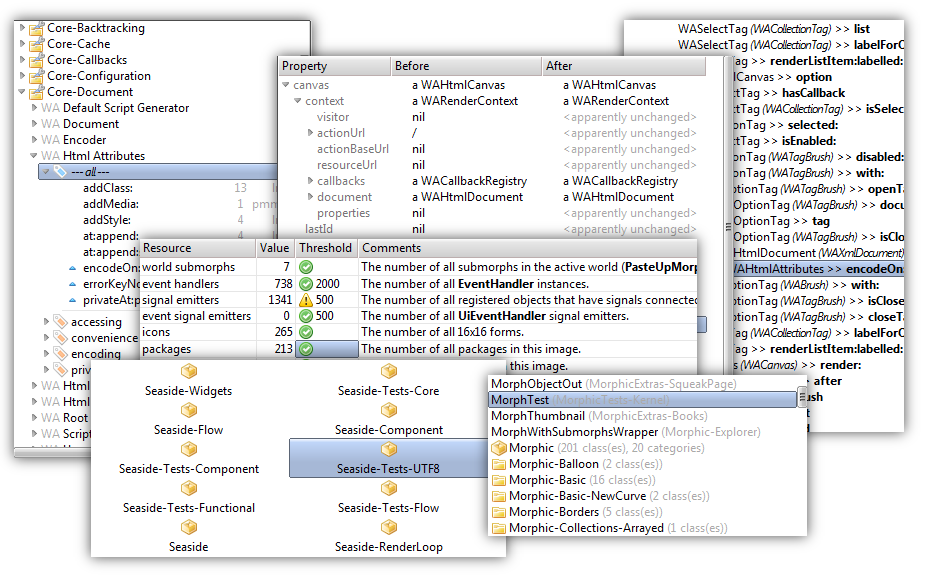

#Widgets [](http://travis-ci.org/hpi-swa/widgets)
Interactive, graphical controls for Squeak/Smalltalk.



See also [Signals](../../../signals) and [Animations](../../../animations).

##How to Install

1. Get [Squeak 4.6 or later](http://www.squeak.org) with a recent [CogVM](http://www.mirandabanda.org/files/Cog/VM/) for your operating system.
2. If not already integrated, load [Metacello](https://github.com/dalehenrich/metacello-work). Learn how it [works](https://github.com/dalehenrich/metacello-work/blob/master/docs/MetacelloUserGuide.md).
3. Finally, load the project into your Squeak image:

```Smalltalk
Metacello new
  baseline: 'Widgets';
  repository: 'github://hpi-swa/widgets/repository';
  load.
```
